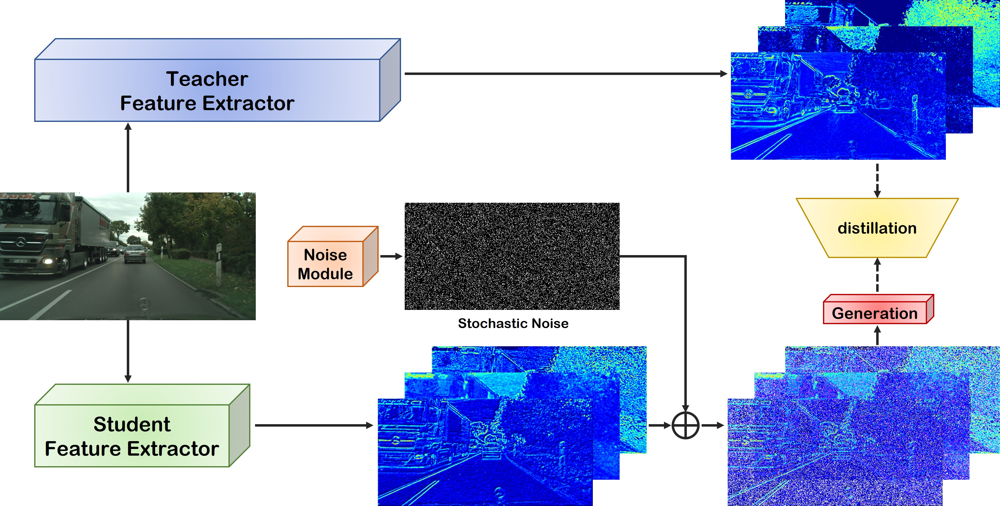

# GDD
Generative Denoise Distillation: Simple Stochastic Noises Induce Efficient Knowledge Transfer for Dense Prediction

## Object Classification and Instance Segmentation
Please refer to [object detection and instance segmentation]()
## Semantic Segmentation 
Please refer to [semantic segmentation]()

## Citation
